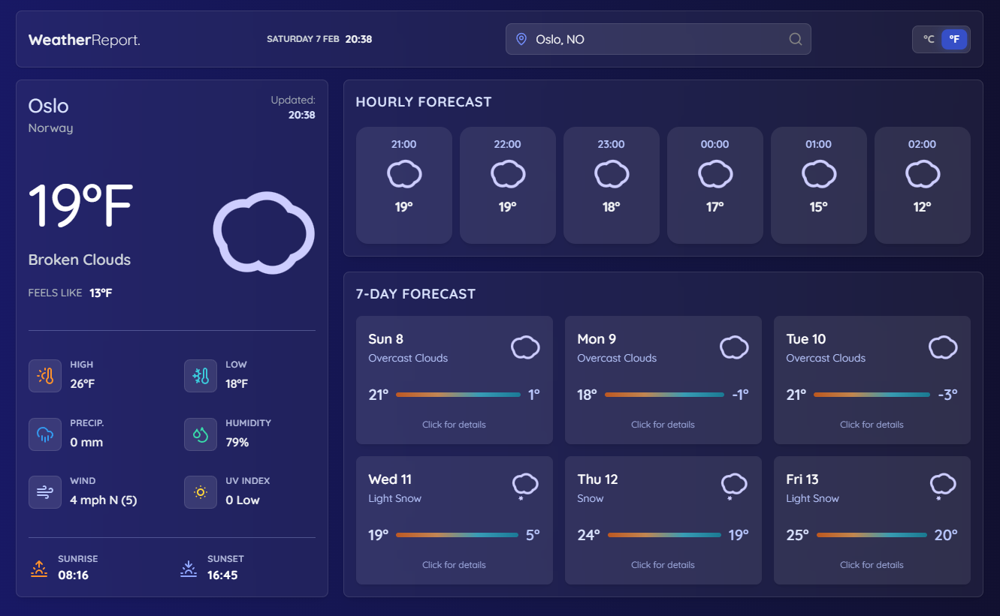

  

<h1 align="center">
  ☀️ WeatherReport
</h1>

A weather app developed using React and the OpenWeathermap API

## Built with

- React
- Mantine UI
- SCSS
- [OpenWeathermap API](https://openweathermap.org/api)
- Favicon from: [Figma File](https://www.figma.com/community/file/971051749541378755/weather-icons-community)

## 🤝 Contributing

Contributions, issues, and feature requests are welcome!
